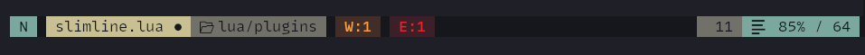
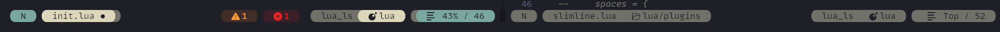

<h2 align="center">
 <br/>
 slimline.nvim
</h2>

<!-- panvimdoc-ignore-start -->

[](https://neovim.io/)


<!-- panvimdoc-ignore-end -->

Another Neovim statusline written in Lua.

The goal is to provide a visual pleasing and efficient statusline.
It started with writing my own statusline.
Reason for writing was to learn more about the Neovim ecosystem and having exactly what I want, function and aesthetic wise.

In the meantime it is a quite generic and configurable alternative to other popular statuslines.

## Impressions

Here are some screenshots that might be a bit outdated. See [recipes](#recipes) for config examples.







## Components

Available components:

- `mode`, vim mode. Automatically sets `vim.opt.showmode = false`.
- `path`, shows the filename and the relative path + modified / read-only info. The directory path will be truncated. Can be disabled and configured.
- `git`, shows the git branch + file diff infos (added, modified and removed lines) (requires [gitsigns](https://github.com/lewis6991/gitsigns.nvim))
- `diagnostics`, shows `vim.diagnostic` infos. This component is event driven and will not poll the information on every statusline draw.
- `filetype_lsp`, shows the file type and attached LSPs. Attached LSPs are evaluated event driven on LSP attach / detach events. LSP names can be mapped to custom names or disabled using `configs.filetype_lsp.map_lsps`.
- `progress`, shows the file progress in % and the overall number of lines as well as the cursor column
- `recording`, shows the register being used for macro recording

Which components to show in which section (`left`, `right`, `center`) can be configured.
The `components` entries accept function calls and strings so that you can create custom comonents.
See [Custom components](#custom-components) for an introduction.

Components have a _flow_ direction which means that components on the left have their primary part on the left side
and components on the right have their primary part on their right side.

## Contributing

Feel free to create an issue/PR if you want to see anything else implemented.

<!-- panvimdoc-ignore-start -->

## Installation

### [lazy.nvim](https://github.com/folke/lazy.nvim)

```lua
{
    -- Calls `require('slimline').setup({})`
    "sschleemilch/slimline.nvim",
    opts = {}
},
```

Optional dependencies:

- [gitsigns](https://github.com/lewis6991/gitsigns.nvim) if you want the `git` component. Otherwise it will just not be rendered
- [mini.icons](https://github.com/echasnovski/mini.icons) if you want icons next to the filetype

You'll also need to have a patched [nerd font](https://www.nerdfonts.com/) if you want icons and separators.

> [!TIP]
> You can decide whether you would like to have a global statusline or one for each split by setting `vim.opt.laststatus` accordingly
> in your settings.

If you decide to **not** use a global one then you can configure via `components_inactive` what will be rendered in the inactive one.
By default, all `components` will be shown. Inactive components will use the _secondary_ highlighting for primary parts.

 shows an example using default options.

#### Default configuration

```lua
require('slimline').setup {
{
  bold = false, -- makes primary parts bold

  -- Global style. Can be overwritten using `configs.<component>.style`
  style = 'bg', -- or "fg"

  -- Component placement
  components = {
    left = {
      'mode',
      'path',
      'git',
    },
    center = {},
    right = {
      'diagnostics',
      'filetype_lsp',
      'progress',
    },
  },

  -- Hide statusline in the following filetypes
  disabled_filetypes = {},

  -- Inactive components
  -- Uses all `components` by default.
  -- E.g. for only showing `path`:
  -- components_inactive = {
  --   left = { 'path' },
  --   right = {},
  -- },
  components_inactive = {},

  -- Component configuration
  -- `<component>.style` can be used to overwrite the global 'style'
  -- `<component>.sep` can be used to overwrite the global 'sep.left' and `sep.right`
  -- `<component>.hl = { primary = ..., secondary = ...}` can be used to overwrite global ones
  -- `<component>.follow` can point to another component name to follow its style (e.g. 'progress' following 'mode' by default). Follow can be disabled by setting it to `false`
  configs = {
    mode = {
      verbose = false, -- Selects the `verbose` format
      hl = {
        normal = 'Type',
        visual = 'Keyword',
        insert = 'Function',
        replace = 'Statement',
        command = 'String',
        other = 'Function',
      },
      format = {
        ['n'] = { verbose = 'NORMAL', short = 'N' },
        ['v'] = { verbose = 'VISUAL', short = 'V' },
        ['V'] = { verbose = 'V-LINE', short = 'V-L' },
        ['\22'] = { verbose = 'V-BLOCK', short = 'V-B' },
        ['s'] = { verbose = 'SELECT', short = 'S' },
        ['S'] = { verbose = 'S-LINE', short = 'S-L' },
        ['\19'] = { verbose = 'S-BLOCK', short = 'S-B' },
        ['i'] = { verbose = 'INSERT', short = 'I' },
        ['R'] = { verbose = 'REPLACE', short = 'R' },
        ['c'] = { verbose = 'COMMAND', short = 'C' },
        ['r'] = { verbose = 'PROMPT', short = 'P' },
        ['!'] = { verbose = 'SHELL', short = 'S' },
        ['t'] = { verbose = 'TERMINAL', short = 'T' },
        ['U'] = { verbose = 'UNKNOWN', short = 'U' },
      },
    }
    path = {
      directory = true, -- Whether to show the directory
      -- truncates the directory path. Can be disabled by setting `truncate = false`
      truncate = {
        chars = 1, -- number of characters for each path component
        full_dirs = 2, -- how many path components to keep unshortened
      },
      icons = {
        folder = ' ',
        modified = '',
        read_only = '',
      },
    },
    git = {
      icons = {
        branch = '',
        added = '+',
        modified = '~',
        removed = '-',
      },
    },
    diagnostics = {
      workspace = false, -- Whether diagnostics should also show the total amount of workspace diagnostics
      icons = {
        ERROR = ' ',
        WARN = ' ',
        HINT = ' ',
        INFO = ' ',
      },
    },
    filetype_lsp = {
      -- Map lsp client names to custom names or ignore them by setting to `false`
      -- E.g. { ['tsserver'] = 'TS', ['pyright'] = 'Python', ['GitHub Copilot'] = false }
      map_lsps = {},
    },
    },
    progress = {
      follow = 'mode',
      column = false, -- Enables a secondary section with the cursor column
      icon = ' ',
    },
    recording = {
      icon = ' ',
    },
  },

  -- Spacing configuration
  spaces = {
    components = ' ', -- string between components
    left = ' ', -- string at the start of the line
    right = ' ', -- string at the end of the line
  },

  -- Seperator configuartion
  sep = {
    hide = {
      first = false, -- hides the first separator of the line
      last = false, -- hides the last separator of the line
    },
    left = '', -- left separator of components
    right = '', -- right separator of components
  },

  -- Global highlights
  hl = {
    base = 'Normal', -- highlight of the background
    primary = 'Normal', -- highlight of primary parts (e.g. filename)
    secondary = 'Comment', -- highlight of secondary parts (e.g. filepath)
  },
}
```

## Highlights

Slimline creates highlight groups with the base highlights chosen in the `hl` section of the config.
The default ones should be a safe choice to work well with most colorschemes but of course you can adapt
them to your liking. Depending on the chosen `style` (fg or bg) the color will be used as a foreground
or as a background color.

> [!NOTE]
> When using a transparent colorscheme and using `style=bg` it means that the actual
> background will be used as a foreground color for text. Since a transparent theme has
> no background color, Slimline will fall back to `#000000` for dark themes and to `#ffffff`
> for white themes

## Recipes

### Pure


```lua
opts = {
  style = 'fg',
  bold = true,
  hl = {
    secondary = 'Comment',
  },
  configs = {
    mode = {
      hl = {
        normal = 'Type',
        visual = 'Keyword',
        insert = 'Function',
        replace = 'Statement',
        command = 'String',
        other = 'Function',
      },
    },
    path = {
      hl = {
        primary = 'Label',
      },
    },
    git = {
      hl = {
        primary = 'Function',
      },
    },
    filetype_lsp = {
      hl = {
        primary = 'String',
      },
    },
  },
}
```

### Rainbow


```lua
opts = {
  style = 'bg',
  configs = {
    path = {
      hl = {
        primary = 'Define',
      },
    },
    git = {
      hl = {
        primary = 'Function',
      },
    },
    filetype_lsp = {
      hl = {
        primary = 'String',
      },
    },
  },
}
```

### Calm format


```lua
opts = {
    style = "fg"
}
```

### Slashes format


```lua
opts = {
    spaces = {
        components = "",
        left = "",
        right = "",
    },
    sep = {
        hide = {
            first = true,
            last = true,
        },
        left = "",
        right = "",
    },
}
```

### Bubble chain


```lua
opts = {
    spaces = {
        components = "─",
        left = "─",
        right = "─",
    },
},
```

And adding fillchars `stl` nvim setting:

```lua
vim.opt.fillchars = {
	stl = "─",
}
```

## Custom components

The `components` part of the config accepts function calls.
This opens the door extending Slimline with your own content.

> [!WARNING]
> This section uses internal APIs. Since I am not committing
> to stable internal APIs yet, it can change!
> Be carfeul when using it. The section will be updated accordingly
> when interfaces change though.

Let's create a center component using a function like this directly in the config:

```lua
opts = {
    components = {
        center = {
            function ()
                return "Hello World"
            end
        },
    }
}
```

It will render to something like this (depending on your colorscheme):


If you want to use internal render functionality of a component (here of the `path` component) you can do it like that:

```lua
function()
    return Slimline.highlights.hl_component(
        { primary = 'Hello', secondary = 'World' },
        Slimline.highlights.hls.components['path'],
        Slimline.get_sep('path')
    )
end
```

> [!WARNING]
> The component to use the highlights and seperator from needs to be configured in your `components` since slimline only creates highlights for used ones.

It will now render to that (depending on the config)


Of course you can use `Slimline*` highlight groups on your own to create your own styled component

The following lua table is required to be passed if you want to use `hl_component()`:

```lua
hl = {
    primary = {
        text = '',
        sep = '',
        sep2sec = '',
    },
    secondary = {
        text = '',
        sep = '',
    }
}
```

## Similar plugins

- [nvim-lualine/lualine.nvim](https://github.com/nvim-lualine/lualine.nvim)
- [echasnovski/mini.statusline](https://github.com/echasnovski/mini.statusline/blob/main/README.md)
