# slimline.nvim

<!-- panvimdoc-ignore-start -->

[](https://neovim.io/)


<!-- panvimdoc-ignore-end -->

A minimal Neovim statusline written in Lua.
Do we need another statusline? Probably not, do we have one? Yep

It started with doing my own statusline implementation.
Reason for writing it was mainly just 4 fun and having exactly what I want, function and aesthetic wise.

## Screenshots

Here are some screenshots. See [recipes](#recipes) for config examples.

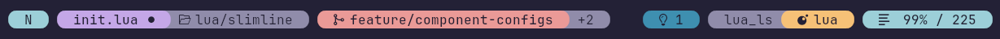
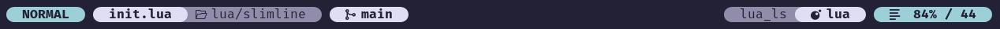
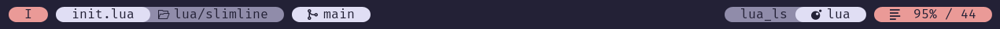
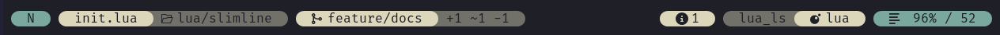
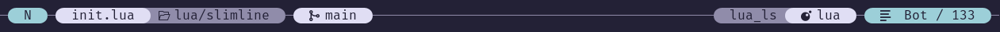
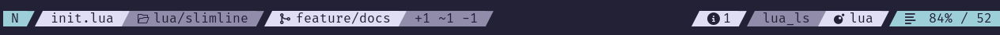
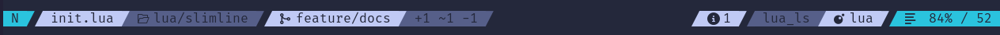
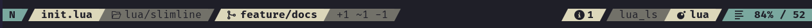
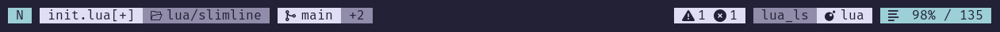
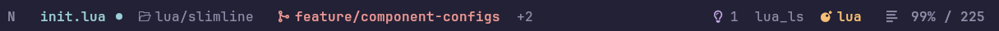
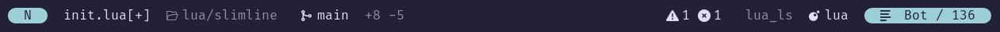
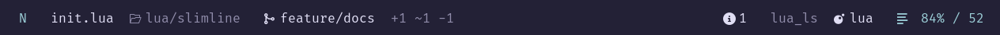
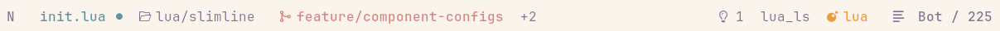
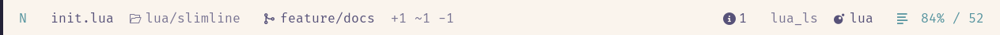
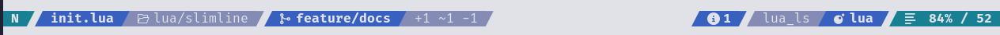

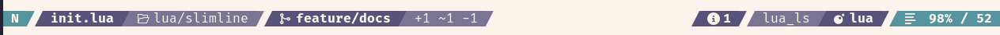

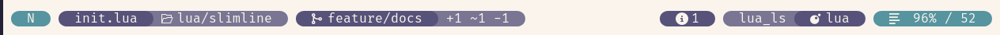
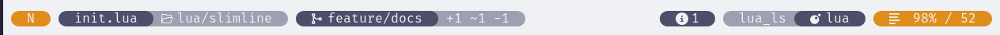
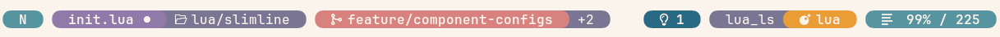

## Components

Available components:

- `mode`, well, you know what it is
- `path`, shows the filename and the relative path + modified / read-only info
- `git`, shows the git branch + file diff infos (added, modified and removed lines) (requires [gitsigns](https://github.com/lewis6991/gitsigns.nvim))
- `diagnostics`, shows `vim.diagnostic` infos
- `filetype_lsp`, shows the filetype and attached LSPs
- `progress`, shows the file progress in % and the overall number of lines
- `recording`, shows the register being used for recording (not enabled by default)

Which components to show in which section (`left`, `right`, `center`) can be configured.
Components can be configured more than once if desired.
The components configuration accepts function calls and strings so that you can hook custom content into the line.
See [Custom components](#custom-components) for an introduction.

## Contributing

Feel free to create an issue/PR if you want to see anything else implemented.

<!-- panvimdoc-ignore-start -->

## Installation

### [lazy.nvim](https://github.com/folke/lazy.nvim)

```lua
{
    -- Calls `require('slimline').setup({})`
    "sschleemilch/slimline.nvim",
    opts = {}
},
```

Optional dependencies:

- [gitsigns](https://github.com/lewis6991/gitsigns.nvim) if you want the `git` component. Otherwise it will just not be shown
- [mini.icons](https://github.com/echasnovski/mini.icons) if you want icons next to the filetype

You'll also need to have a patched [nerd font](https://www.nerdfonts.com/) if you want icons and separators.

#### Default configuration

```lua
require('slimline').setup {
{
  bold = false, -- makes primary parts bold

  -- Global style. Can be overwritten using `configs.<component>.style`
  style = 'bg', -- or "fg"

  -- Component placement
  components = {
    left = {
      'mode',
      'path',
      'git',
    },
    center = {},
    right = {
      'diagnostics',
      'filetype_lsp',
      'progress',
    },
  },

  -- Component configuration
  -- `<component>.style` can be used to overwrite the global 'style'
  -- `<component>.sep` can be used to overwrite the global 'sep.left' and `sep.right`
  -- `<component>.hl = { primary = ..., secondary = ...}` can be used to overwrite global ones
  -- `<component>.follow` can point to another component name to follow its style (e.g. 'progress' following 'mode' by default). Follow can be disabled by setting it to `false`
  configs = {
    mode = {
      verbose = false, -- Mode as single letter or as a word
      hl = {
        normal = 'Type',
        insert = 'Function',
        pending = 'Boolean',
        visual = 'Keyword',
        command = 'String',
      },
    },
    path = {
      directory = true, -- Whether to show the directory
      icons = {
        folder = ' ',
        modified = '',
        read_only = '',
      },
    },
    git = {
      icons = {
        branch = '',
        added = '+',
        modified = '~',
        removed = '-',
      },
    },
    diagnostics = {
      workspace = false, -- Whether diagnostics should show workspace diagnostics instead of current buffer
      placeholders = false, -- Whether to show empty boxes for zero values. Only relevant if `style==bg`
      icons = {
        ERROR = ' ',
        WARN = ' ',
        HINT = ' ',
        INFO = ' ',
      },
    },
    filetype_lsp = {},
    progress = {
      follow = 'mode',
      column = false, -- Enables a secondary section with the cursor column
      icon = ' ',
    },
    recording = {
      icon = ' ',
    },
  },

  -- Spacing configuration
  spaces = {
    components = ' ', -- string between components
    left = ' ', -- string at the start of the line
    right = ' ', -- string at the end of the line
  },

  -- Seperator configuartion
  sep = {
    hide = {
      first = false, -- hides the first separator of the line
      last = false, -- hides the last separator of the line
    },
    left = '', -- left separator of components
    right = '', -- right separator of components
  },

  -- Global highlights
  hl = {
    base = 'Normal', -- highlight of the background
    primary = 'Normal', -- highlight of primary parts (e.g. filename)
    secondary = 'Comment', -- highlight of secondary parts (e.g. filepath)
  },
}
```

## Highlights

Slimline creates highlight groups with the base highlights chosen in the `hl` section of the config.
The default ones should be a safe choice to work well with most colorschemes but of course you can adapt
them to your liking. Depending on the chosen `style` (fg or bg) the color will be used as a foreground
or as a background color.

> [!NOTE]
> When using a transparent colorscheme and using `style=bg` it means that the actual
> background will be used as a foreground color for text. Since a transparent theme has
> no background color, Slimline will fall back to `#000000` for dark themes and to `#ffffff`
> for white themes

## Commands

A `Slimline` command is available with the following sub commands:

- `switch`: Accepts only one parameter until now: `style`. Will switch the global style

## Recipes

### Pure


```lua
opts = {
  style = 'fg',
  bold = true,
  hl = {
    secondary = 'Comment',
  },
  configs = {
    mode = {
      hl = {
        normal = 'Comment',
        insert = 'Normal',
        pending = 'Normal',
        visual = 'Normal',
        command = 'Normal',
      },
    },
    path = {
      hl = {
        primary = 'Label',
      },
    },
    git = {
      hl = {
        primary = 'Function',
      },
    },
    filetype_lsp = {
      hl = {
        primary = 'String',
      },
    },
  },
}
```

### Rainbow


```lua
opts = {
  style = 'bg',
  configs = {
    path = {
      hl = {
        primary = 'Define',
      },
    },
    git = {
      hl = {
        primary = 'Function',
      },
    },
    filetype_lsp = {
      hl = {
        primary = 'String',
      },
    },
  },
}
```

### Calm format


```lua
opts = {
    style = "fg"
}
```

### Slashes format


```lua
opts = {
    spaces = {
        components = "",
        left = "",
        right = "",
    },
    sep = {
        hide = {
            first = true,
            last = true,
        },
        left = "",
        right = "",
    },
}
```

### Bubble chain


```lua
opts = {
    spaces = {
        components = "─",
        left = "─",
        right = "─",
    },
},
```

And adding fillchars `stl` nvim setting:

```lua
vim.opt.fillchars = {
	stl = "─",
}
```

## Custom components

The `components` part of the config accepts function calls.
This opens the door extending Slimline with your own content.

> [!WARNING]
> This section uses internal APIs. Since I am not committing
> to stable internal APIs yet, it can change!
> Be carfeul when using it. The section will be updated accordingly
> when interfaces change though.

Let's create a center component using a function like this directly in the config:

```lua
opts = {
    components = {
        center = {
            function ()
                return "Hello World"
            end
        },
    }
}
```

It will render to something like this (depending on your colorscheme):

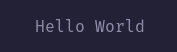

If you want to use internal render functionality of a component (here of the `path` component) you can do it like that:

```lua
function()
    local h = require('slimline.highlights')
    local c = require('slimline').config
    return h.hl_component({ primary = 'Hello', secondary = 'World' }, h.hls.components['path'], c.sep)
end
```

> [!WARNING]
> The component to use the highlights from needs to be configured in your `components` since slimline only creates highlights for used ones.

It will now render to that (depending on the config)

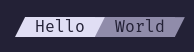

Of course you can use `Slimline*` highlight groups on your own to create your own styled component

The following lua table is required to be passed if you want to use `hl_component()`:

```lua
hl = {
    primary = {
        text = '',
        sep = '',
        sep2sec = '',
    },
    secondary = {
        text = '',
        sep = '',
    }
}
```
