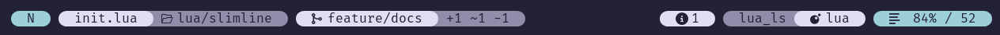

# slimline.nvim

<!-- panvimdoc-ignore-start -->


<!-- panvimdoc-ignore-end -->

> [!WARNING]
> The project is new, does not have releases and is a Work in Progress. Therefore interfaces can change frequently

A minimal Neovim statusline written in Lua.
Do we need another statusline? Probably not, do we have one? Yep

It started with doing my own statusline implementation.
Reason for writing it was mainly just 4 fun and having exactly what I want, function and aesthetic wise.

## Screenshots

Here are some screenshots. See [recipes](#recipes) for config examples.




## Components

Available components:

- `mode`, well, you know what it is
- `path`, shows the filename and the relative path + modified / read-only info
- `git`, shows the git branch + file diff infos (added, modified and removed lines) (requires [gitsigns](https://github.com/lewis6991/gitsigns.nvim))
- `diagnostics`, shows `vim.diagnostic` infos
- `filetype_lsp`, shows the filetype and attached LSPs
- `progress`, shows the file progress in % and the overall number of lines

Which components to show in which section (`left`, `right`, `center`) can be configured.
Components can be configured more than once if desired.
The components configuration accepts function calls and strings so that you can hook custom content into the line.
See [Custom components](#custom-components) for an introduction.


## Contributing

Feel free to create an issue/PR if you want to see anything else implemented.

<!-- panvimdoc-ignore-start -->

## Installation

### [lazy.nvim](https://github.com/folke/lazy.nvim)

```lua
{
    -- Calls `require('slimline').setup({})`
    "sschleemilch/slimline.nvim",
    opts = {}
},
```

Optional dependencies:

- [gitsigns](https://github.com/lewis6991/gitsigns.nvim) if you want the `git` component. Otherwise it will just not be shown
- [mini.icons](https://github.com/echasnovski/mini.icons) if you want icons next to the filetype

You'll also need to have a patched [nerd font](https://www.nerdfonts.com/) if you want icons and separators.

#### Default configuration

```lua
require('slimline').setup {
  bold = false, -- makes primary parts and mode bold
  verbose_mode = false, -- Mode as single letter or as a word
  style = 'bg', -- or "fg". Whether highlights should be applied to bg or fg of components
  components = { -- Choose components and their location
    left = {
      "mode",
      "path",
      "git"
    },
    center = {},
    right = {
      "diagnostics",
      "filetype_lsp",
      "progress"
    }
  },
  spaces = {
    components = ' ', -- string between components
    left = ' ', -- string at the start of the line
    right = ' ', -- string at the end of the line
  },
  sep = {
    hide = {
      first = false, -- hides the first separator
      last = false, -- hides the last separator
    },
    left = '', -- left separator of components
    right = '', -- right separator of components
  },
  hl = {
    modes = {
      normal = 'Type', -- highlight base of modes
      insert = 'Function',
      pending = 'Boolean',
      visual = 'Keyword',
      command = 'String',
    },
    base = 'Comment', -- highlight of everything in in between components
    primary = 'Normal', -- highlight of primary parts (e.g. filename)
    secondary = 'Comment', -- highlight of secondary parts (e.g. filepath)
  },
  icons = {
    diagnostics = {
      ERROR = ' ',
      WARN = ' ',
      HINT = ' ',
      INFO = ' ',
    },
    git = {
      branch = '',
    },
    folder = ' ',
    lines = ' ',
  },
}
```

## Highlights

Slimline creates highlight groups with the base highlights chosen in the `hl` section of the config.
The default ones should be a safe choice to work well with most colorschemes but of course you can adapt
them to your liking. Depending on the chosen `style` (fg or bg) the color will be used as a foreground
or as a background color.


> [!NOTE]
> When using a transparent colorscheme and using `style=bg` it means that the actual
> background will be used as a foreground color for text. Since a transparent theme has
> no background color, Slimline will fall back to `#000000` for dark themes and to `#ffffff`
> for white themes


## Recipes

### Calm format


```lua
opts = {
    style = "fg"
}
```


### Slashes format


```lua
opts = {
    spaces = {
        components = "",
        left = "",
        right = "",
    },
    sep = {
        hide = {
            first = true,
            last = true,
        },
        left = "",
        right = "",
    },
}
```

## Custom components

The `components` part of the config accepts function calls.
This opens the door extending Slimline with your own content.

Let's create a center component using a function like this directly in the config:

```lua
center = {
    function ()
        return "Hello World"
    end
},
```

It will render to something like this (depending on your colorscheme):


Let's add some color. To do that we can use the `highlights` component of slimline:

```lua
function ()
    local sh = require("slimline.highlights")
    local content = "Hello World"
    return sh.highlight_content(content, sh.hls.primary.text)
end
```
It will now look like that:


To add configured separators we can add them to `highlight_content`:

```lua
function ()
    local sh = require("slimline.highlights")
    local cfg = vim.g.slimline_config
    local content = " Hello World "
    return sh.highlight_content(content, sh.hls.primary.text, cfg.sep.left, cfg.sep.right)
end
```

Now we have a primary part of a new component:


To add a secondary part we need to change it like that:

```lua
function ()
    local sh = require("slimline.highlights")
    local cfg = vim.g.slimline_config
    local content = sh.highlight_content(" Hello ", sh.hls.primary.text, cfg.sep.left)
    content = content .. sh.highlight_content(cfg.sep.right, sh.hls.primary.sep_transition)
    content = content .. sh.highlight_content(" World ", sh.hls.secondary.text, nil, cfg.sep.right)
    return content
end
```

And we have our final result of a custom component which respects separators and colors from the config:


